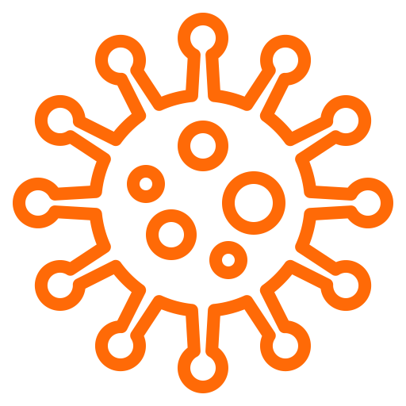
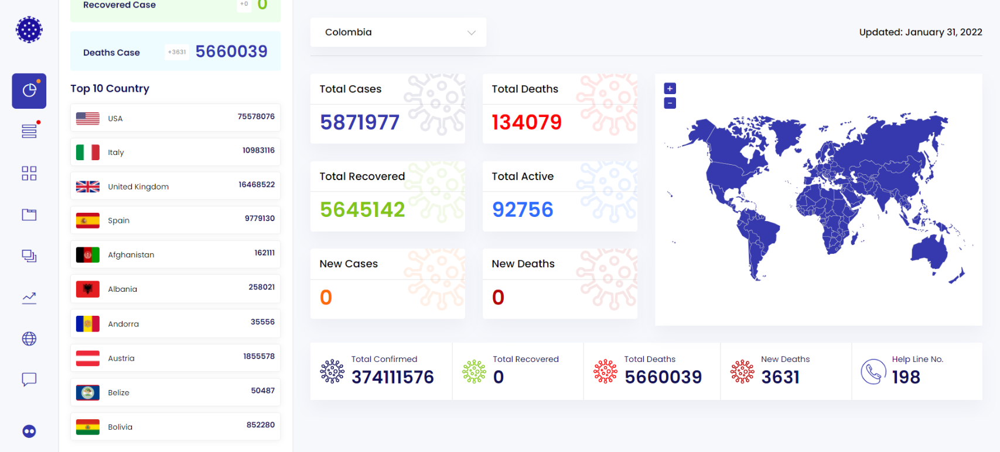
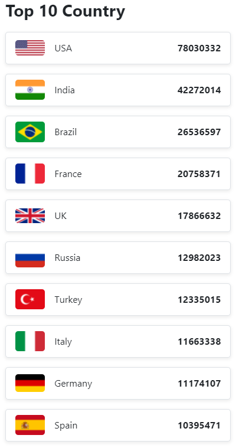

<p align="center"> 
  
</p>

# Impacto Covid19 en el mundo

Se trabajo en crear una página web con un dashboard en el que se pueda ver el número de los contagios de covid-19 hasta la fecha, así como el número de recuperados y el número de personas vacunadas, todo ello consuminedo informacion desde una <a href="https://disease.sh/">API</a>.

<br>
<br>

## Mockups de este proyecto 🛠️

Son varias vistas las que componen el proyecto, las cuales se encuentran en la carpeta [Mockups](./Mockups). A continuación se muestra el Mockup de la vista del Tracker_1 en éste proyecto:

<p align="center"> 
  
</p>

<br>
<br>

## Capturas de Pantalla ⚙️

A continuación se muestran varios fragmentos de codigo, mostarndo parte de la maquetacion y el consumo de la API para mostrar algunos datos en el Dashboard, aclarando que en gran parte se uso Bootstrap como framework:

<p style="font-weight:bold" align="center">HTML</p>

```HTML
<div id="sideBar" class="p-3 d-none d-md-block divCovidTracker overflow-auto">
  <h1 class="fs-3 fw-bold">COVID-19 Tracker</h1>
  <div id="colorCards" class="mt-4"></div>
  <p class="fs-3 fw-bold">Top 10 Country</p>
</div>
```

<p style="font-weight:bold" align="center">JAVASCRIPT</p>

```JAVASCRIPT
const divSideBar = document.getElementById("sideBar");

fetch("https://disease.sh/v3/covid-19/countries")
  .then((response) => response.json())
  .then((data) => {
    const sortCases = data.sort((a, b) => b.cases - a.cases);
    const top10Cases = sortCases.slice(0, 10);

    top10Cases.map(
      (country) =>
        (divSideBar.innerHTML += `
    <div class="d-flex flex-wrap justify-content-between align-items-center border border-1 px-3 py-2 rounded-3 top10Card mb-3">
      <div class="d-flex flex-row align-items-center">
        
        <p class="mb-0 ms-3">${country.country}</p>
      </div>

      <p class="fw-bold m-0">${country.cases}</p>

    </div>`)
    );
  });
```

<div align="center">
  <p style="font-weight:bold">RESULTADO</p>
  
</div>

<br>
<br>

## Requerimientos técnicos ⚙️

* El proyecto DEBE utilizar la metodología Scrum.
* Se DEBE utilizar Gitflow.
* Se DEBE consumir la API de disease.sh para traer los datos.
* La página DEBE ser responsive.
* Se debe hacer una landing page que sea fiel a mockup.
* El sprint finalizará el día viernes 4 de febrero a las 11:59 pm.
* El diseño DEBE ser fiel al mockup y utilizar las imágenes y los íconos que se dejaron en los recursos.
* La página DEBE mostrar los datos que aparcen en los mockups:

  - Total de contagios.

  - Total muertes.

  - Total de recuperados.

  - Total de casos activos.

  - Nuevos casos.

  - Nuevas muertes.
* La página DEBE filtrar por países.
* En la parte de la tabla se DEBE poder organizar en orden según cada item.
* La página DEBE Permitir que el usuario decida qué numero de resultados quiere ver * en la tabla.
* La página debe permitir búsquedas por palabras clave.
* La página DEBE mostrar en alguna parte la cantidad de vacunados en el mundo.
* La página DEBE filtrar los vacunados por país.
* El sitio debe ser interactivo y generar las animaciones que se muestran en el * video.
* No se pueden utilizar frameworks ni librerías de Javascript excepto la * especificada en las recomendaciones.
* El repositorio DEBE tener un Readme muy específico, con capturas de pantalla y los pasos para la instalación de las librerías si las van a usar.


## Recurso(s)
- https://getbootstrap.com/docs/5.0/getting-started/introduction/
- https://tailwindcss.com/
- https://d3js.org/
- https://github.com/AndresEstebanPatino/recursos-app-covid
- https://disease.sh/
- https://developer.mozilla.org/es/docs/Glossary/CSS_preprocessor


## Entregables
- Product backlog.
- Repositorio de Github.
- Enlace del deploy.

<br>
<br>

## Autores ✒️

- **Jymmy Murillo** <a href="https://www.linkedin.com/in/murillojymmy/" target="blank"></a>

- **Luis Felipe Cabal** <a href="https://www.linkedin.com/in/luis-felipe-cabal-4b69281a1/" target="blank"></a>

- **Doraly Santander** <a href="https://www.linkedin.com/in/doraly/" target="blank"></a>
